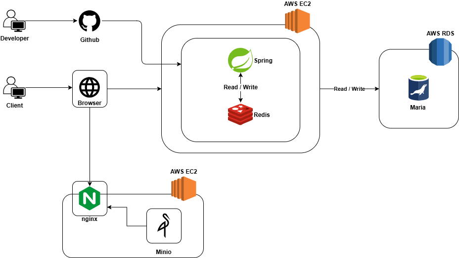

<div align="center">

</div>

<div align="center">
<h3>파일 관리, 실시간 문서 협업, 채팅을 하나로 연결한 통합 워크스페이스</h3>
<p>
<b>파일 저장소</b>, <b>실시간 문서 편집</b>, <b>협업 채팅</b>, <b>알림</b>을 하나의 서비스로 통합한 협업 플랫폼입니다.<br/>
업무 도구 간 전환 비용을 줄이고, 팀 단위 협업 흐름을 자연스럽게 이어주는 것을 목표로 합니다.
</p>
</div>

<div align="center">
<table border="0" width="80%">
<tr>
<td align="center" colspan="4">
<b>TEAM MEMBER</b>
</td>
</tr>
<tr>
<td align="center" width="25%">
<a href="https://github.com/Joohyeng">


김주형
</a>
</td>
<td align="center" width="25%">
<a href="https://github.com/Yoonjoon13">


범윤준
</a>
</td>
<td align="center" width="25%">
<a href="https://github.com/sunyeoplee0">


이선엽 
</a>
</td>
<td align="center" width="25%">
<a href="https://github.com/Lumisia">


최재원
</a>
</td>
</tr>
</table>
</div>

<div align="center">
<a href="#프로젝트-소개">소개</a> &nbsp;|&nbsp;
<a href="#기술-스택">기술 스택</a> &nbsp;|&nbsp;
<a href="#.env-파일-설정"> .env 파일 설정 </a> &nbsp;|&nbsp;
<a href="#swagger-api-문서">Swagger</a> &nbsp;|&nbsp;
<a href="#시스템-아키텍처">아키텍처</a> &nbsp;|&nbsp;
<a href="#데이터베이스-설계">ERD</a> &nbsp;|&nbsp;
<a href="#서비스-도메인">도메인</a>
</div>

<hr/>

<h2 id="프로젝트-소개">프로젝트 소개</h2>

<div align="center">
<p><b>"전환 비용(Switching Cost)을 줄이는 협업 중심 통합 환경"</b></p>
<p>
FileInNOut은 클라우드 파일 저장소, 실시간 문서 협업, 채팅, 알림 기능을 하나의 흐름으로 연결한 워크스페이스입니다.<br/>
사용자는 웹상에서 파일을 관리하고, 문서를 공동 편집하며, 팀원과 실시간으로 소통할 수 있습니다.
</p>
</div>

<h3>Problem & Solution</h3>

<table width="100%">
<tr>
<td width="50%" valign="top">
<h3>Problem (Pain Points)</h3>
<ul>
<li><b>도구의 분리</b>: 파일 저장, 문서 작성, 협업 채팅이 각각 따로 존재해 업무 흐름이 끊어지는 문제</li>
<li><b>협업의 단절</b>: 문서 작업 중인 맥락과 커뮤니케이션이 분리되어 팀 협업 속도가 느려지는 문제</li>
<li><b>복잡한 공유 구조</b>: 파일, 채팅, 워크스페이스마다 공유/초대 흐름이 달라 관리가 어려운 문제</li>
</ul>
</td>
<td width="50%" valign="top">
<h3>Solution (Key Values)</h3>
<ul>
<li><b>통합 협업 공간</b>: 파일, 문서, 채팅, 초대, 알림을 하나의 서비스 안에서 연결</li>
<li><b>실시간 협업 환경</b>: WebSocket, SSE, Yjs 기반 실시간 상호작용 지원</li>
<li><b>유연한 공유 구조</b>: 개인, 그룹, 관계 기반으로 파일/채팅/워크스페이스 공유 가능</li>
</ul>
</td>
</tr>
</table>

<hr/>

<h2 id="기술-스택">기술 스택</h2>

<div align="center">
<h3>Backend & Storage</h3>


<h3>Frontend</h3>


<h3>Realtime & Collaboration</h3>


<h3>Infrastructure</h3>


</div>

<hr/>

<h2 id=".env-파일-설정"> .env 파일 설정 </h2>
<details>
<summary>.env 파일 설정하기</summary>
제 git 주소로 하신다면 .env 설정을 모두 하셔야지만 모든 파일들이 정상적으로 돌아갑니다.

```
# --- Server & SSL Settings ---
KEYSTORE=your_keystore_path_or_classpath
KEYSTORETYPE=your_keystore_type_ex_PKCS12
KEYSTOREPASS=your_keystore_password

# --- Database Settings (MariaDB) ---
DB_SERVER=your_db_driver_class_name
DB_URL=your_db_jdbc_url
DB_ID=your_db_username
DB_PASS=your_db_password

# --- Redis Settings ---
REDIS_HOST=your_redis_host_ip
REDIS_PORT=your_redis_port

# --- JWT Settings ---
JWT_KEY=your_jwt_secret_key_random_string
JWT_EXPIRE=your_jwt_expiration_time_ms

# --- Admin Account Settings ---
ADMIN_EMAIL=your_admin_email_address
ADMIN_NAME=your_admin_display_name
ADMIN_ROLE=your_admin_role_ex_ROLE_ADMIN
ADMIN_PASSWORD=your_admin_account_password

# --- App URL Settings ---
APP_FRONTEND_URL=your_frontend_base_url
APP_BACKEND_URL=your_backend_base_url
APP_SECURE_COOKIE=your_secure_cookie_boolean_true_or_false

# --- OAuth2 Client Settings (Google) ---
GOOGLE_CLIENT_ID=your_google_client_id
GOOGLE_CLIENT_SECRET=your_google_client_secret

# --- OAuth2 Client Settings (Naver) ---
NAVER_CLIENT_ID=your_naver_client_id
NAVER_CLIENT_SECRET=your_naver_client_secret

# --- OAuth2 Client Settings (Kakao) ---
CLIENT_ID=your_kakao_client_id
CLIENT_SECRET=your_kakao_client_secret

# --- Mail Settings (Gmail) ---
MAIL_PORT=your_smtp_mail_port
MAIL_ID=your_mail_username_or_email
MAIL_PASS=your_mail_app_password

# --- MinIO & S3 Storage Settings ---
STORAGE_PROVIDER=your_storage_provider_minio_or_s3
MINIO_API=your_minio_endpoint_url
MINIO_NAME=your_minio_access_key
MINIO_SECRET=your_minio_secret_key
MINIO_CLOUD_BUCKET=your_minio_cloud_bucket_name
MINIO_WORKSPACE_BUCKET=your_minio_workspace_bucket_name
MINIO_REGION=your_minio_region_name

# --- Amazon S3 Settings ---
S3AMAZON_API=your_s3_amazon_endpoint_url
S3AMAZON_NAME=your_s3_amazon_access_key
S3AMAZON_SECRET=your_s3_amazon_secret_key
S3AMAZON_CLOUD_BUCKET=your_s3_amazon_cloud_bucket_name
S3AMAZON_WORKSPACE_BUCKET=your_s3_amazon_workspace_bucket_name
S3AMAZON_REGION=your_s3_amazon_region_name

# --- PortOne Settings ---
PORTONE_SECRET=your_portone_api_secret
```
이 안에 있는 your_~~ 쪽들에 값들을 넣고 환경 변수에다가 .env 파일을 세팅해야 합니다.
</details>

<hr/>


<h2 id="swagger-api-문서">Swagger API 문서</h2>
<details>
<summary>Swagger API 문서 상세 보기</summary>

<a href="https://api.fileinnout.kro.kr/swagger-ui/index.html" target="_blank"> 🚀 Swagger API 명세서 (Live)</a>
<p>백엔드 API 명세와 테스트는 Swagger UI에서 확인할 수 있습니다.</p>
</details>

<hr/>

<h2 id="시스템-아키텍처">시스템 아키텍처</h2>
<details>
<summary>시스템 아키텍처 상세 보기</summary>


</details>

<hr/>

<h2 id="데이터베이스-설계">데이터베이스 설계 (ERD)</h2>
<details>
<summary>데이터베이스 설계도(ERD) 상세 보기</summary>


</details>

<hr/>

<h2 id="서비스-도메인">서비스 도메인</h2>
<div align="left">
<a href="https://www.fileinnout.kro.kr" target="_blank" rel="noopener noreferrer">
<p>www.fileinnout.kro.kr</p>
</a>
</div>

<hr/>

<h2 id="서비스-시나리오">서비스 시나리오 및 기능 데모</h2>

<p>FileInNOut의 주요 기능을 시나리오별로 정리했습니다. 각 항목을 펼쳐 상세 흐름과 데모 화면을 확인할 수 있습니다.</p>

<details>
<summary>1. 사용자 인증 (회원가입 및 로그인)</summary>
<div align="center">

<p>회원가입, 로그인, OAuth 기반 인증과 토큰 기반 세션 흐름을 지원합니다.</p>
</div>
</details>

<details>
<summary>2. 파일 및 문서 관리</summary>
<div align="center">

<p>파일 트리 구조 안에서 폴더/파일을 관리하고, 문서(Page)를 생성해 연결된 작업 흐름을 제공합니다.</p>
</div>
</details>

<details>
<summary>3. 실시간 채팅</summary>
<div align="center">

<p>텍스트, 이미지, 파일 메시지를 기반으로 팀원과 실시간 소통할 수 있으며, 읽음 상태와 알림 흐름을 함께 제공합니다.</p>
</div>
</details>

<details>
<summary>4. 실시간 문서 편집기</summary>
<div align="center">

<p>블록 기반 에디터와 실시간 동시 편집 기능을 통해 협업 문서 작업을 지원합니다.</p>
</div>
</details>

<details>
<summary>5. 그룹, 초대, 공유</summary>
<div align="center">
<p>사용자 간 연결 요청, 그룹 생성, 그룹 초대, 파일/채팅/워크스페이스 공유 기능을 통해 협업 대상을 유연하게 구성할 수 있습니다.</p>
</div>
</details>

<details>
<summary>6. 알림 및 결제</summary>
<div align="center">
<p>실시간 알림으로 초대, 채팅, 요청 상태를 빠르게 확인할 수 있으며, PortOne 기반 결제를 통해 스토리지 확장 흐름을 제공합니다.</p>
</div>
</details>
